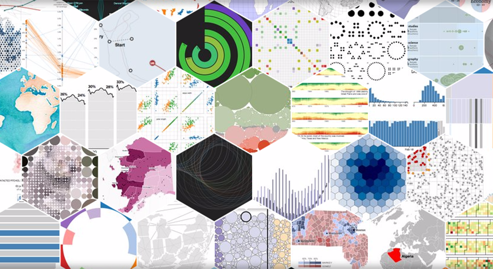
# Data visualization in the age of AI
## Jeremy R. Manning
### PSYC 81.09: Storytelling with Data

---

## Why visualize data?

- Our visual systems **rapidly process massive amounts of information** and are adept at **pattern recognition**
- We can leverage the visual system to convey patterns in data
- Conveying the patterns we want people to perceive means figuring out how to **turn data into pictures**

---

## Which is clearest to you?
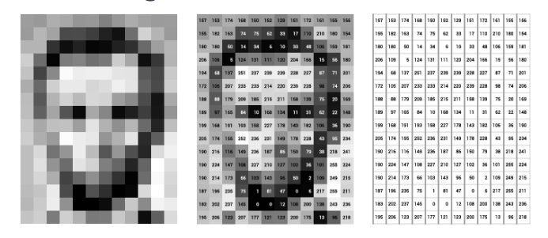

---

## Anscombe's quartet

These four datasets have identical summary statistics, but look very different when plotted!

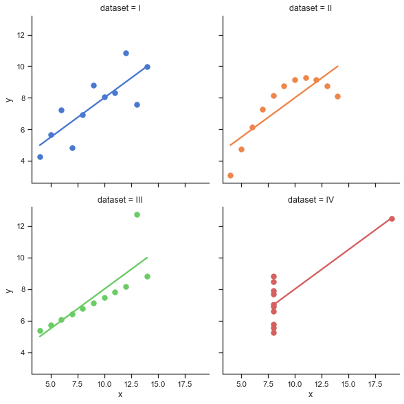

---

**What message do you want your audience to take away?**

Every visualization decision -- color, layout, chart type -- should serve that message. Start with the message, then choose the visualization.

---

We focus on understanding **what** these tools do and **when** to use them -- not memorizing syntax. AI handles the syntax; you handle the thinking.

---

## Vibe coding your visualizations

1. **Describe** the visualization you want in plain language
2. **Generate** it with Claude Code (or another AI coding tool)
3. **Iterate** on the design -- refine colors, labels, layout
4. **Verify and explain** -- make sure the output is correct and you understand every element

---

AI-generated code can produce plots that *look* right but are **wrong** -- axes may be swapped, data may be filtered incorrectly, or statistics may be miscomputed. Always verify the output against your data, and make sure you can explain what every part of the figure shows.

---

## Grammar of graphics

- **Data**: the values being plotted
- **Aesthetics**: mapping from data to visual properties (position, color, size)
- **Geometries**: shapes representing the data (points, bars, lines)
- **Facets**: subplots or groupings
- **Statistics**: summaries or transformations
- **Coordinates**: the coordinate system (Cartesian, polar, geographic)
- **Theme**: non-data elements (fonts, backgrounds, legends)

---

<!-- _class: scale-90 -->

## Choosing the right visualization

- **Comparing categories?** Bar chart, box plot
- **Showing distributions?** Histogram, violin plot
- **Revealing relationships?** Scatter plot, heatmap
- **Tracking change over time?** Line plot
- **Displaying spatial data?** Choropleth map
- **Showing connections?** Network graph
- **Adding a dimension?** Animation

---

# Visualization gallery
### A reference collection of common plot types

---

## Scatter plot
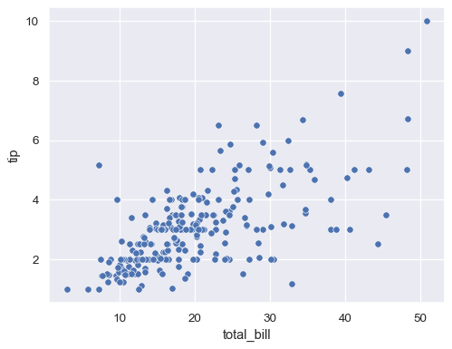

---

## Bar chart
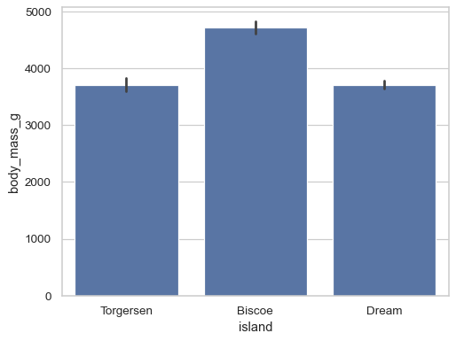

---

## Histogram
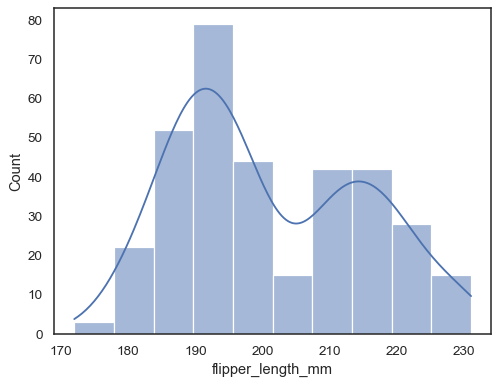

---

## Heatmap
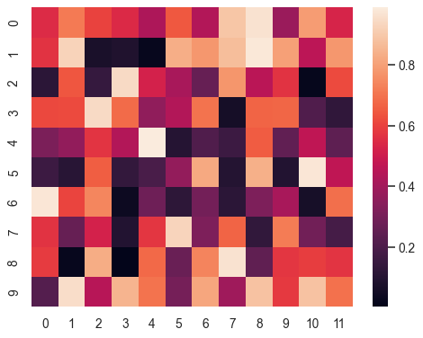

---

## Violin plot
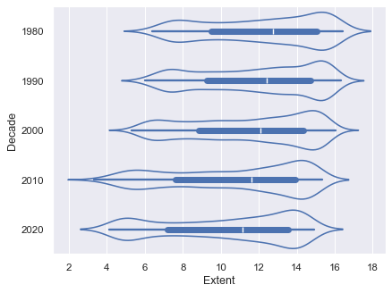

---

## Box plot
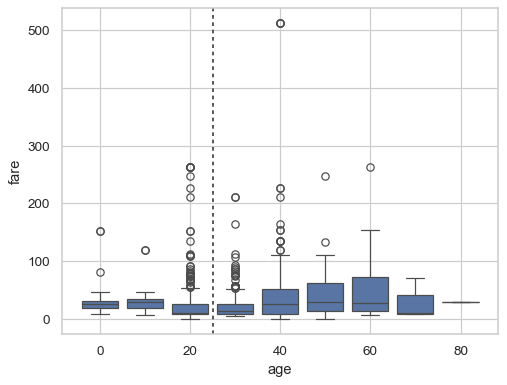

---

## Line plot
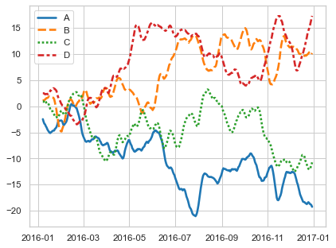

---

## Choropleth map
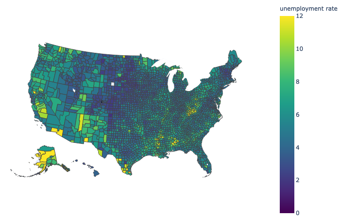

---

## Network graph
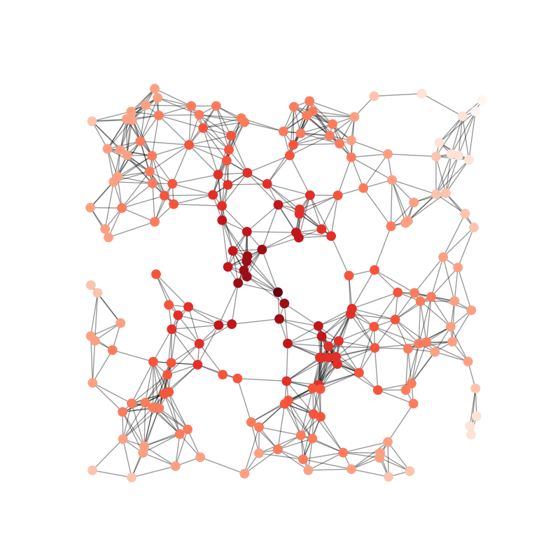

---

## Animation: life expectancy vs. GDP over time
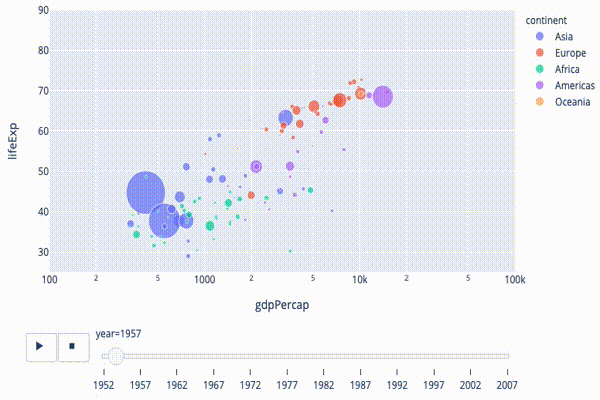

---

## General tips and tricks

- Tufte's **data-to-ink ratio** principle
- Optimize for **intuition and readability**
- Use consistent color schemes to highlight connections
- Use visual weight across figure elements
- **Be willing to break all of the rules!**

---

# Questions? Want to chat more?

  

    &#x1F4E7;
    <a href="mailto:jeremy@dartmouth.edu">Email</a> me
  

  

    &#x1F4AC;
    Join our <a href="https://stories-about-data.slack.com">Slack</a>
  

  

    &#x1F481;
    Come to <a href="https://context-lab.com/scheduler">office hours</a>
  

- **Friday:** Workshop data story ideas + Assignment 2 release

