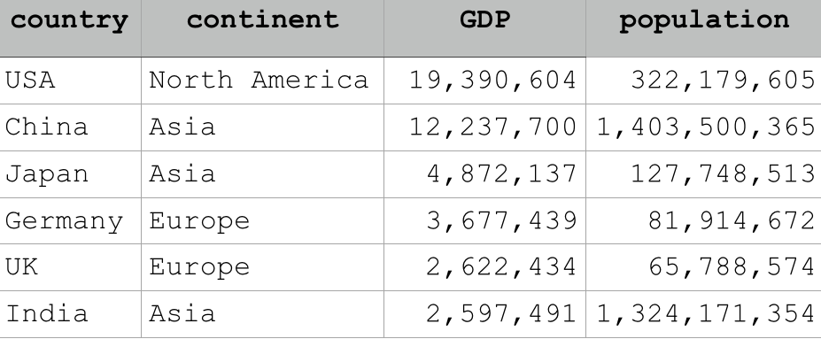
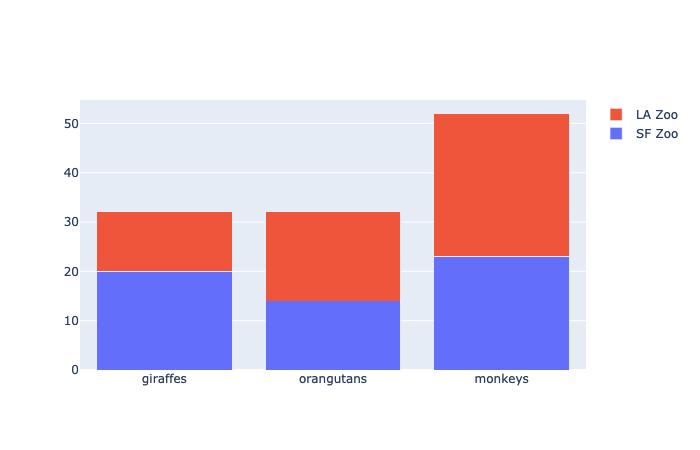
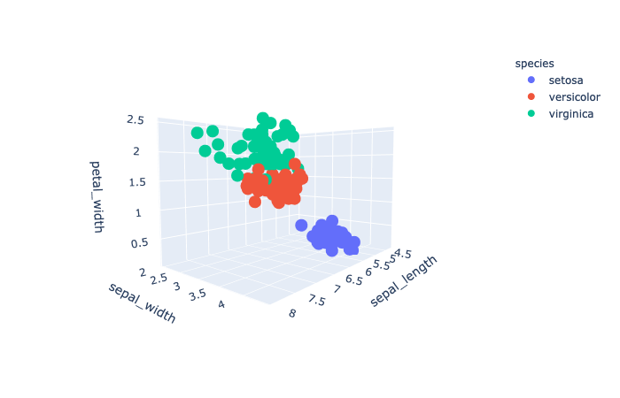
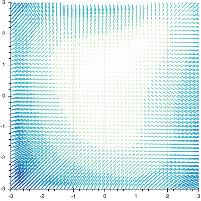
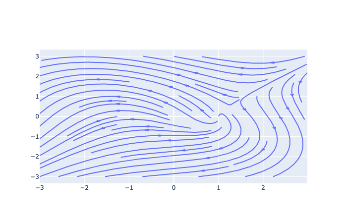
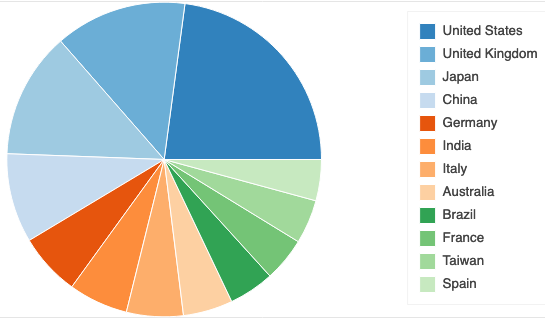
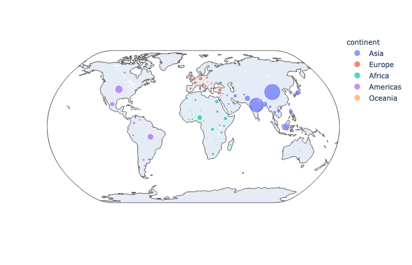
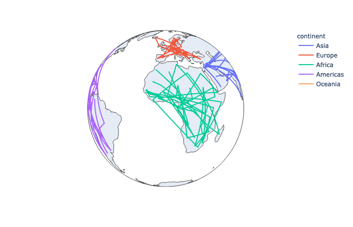
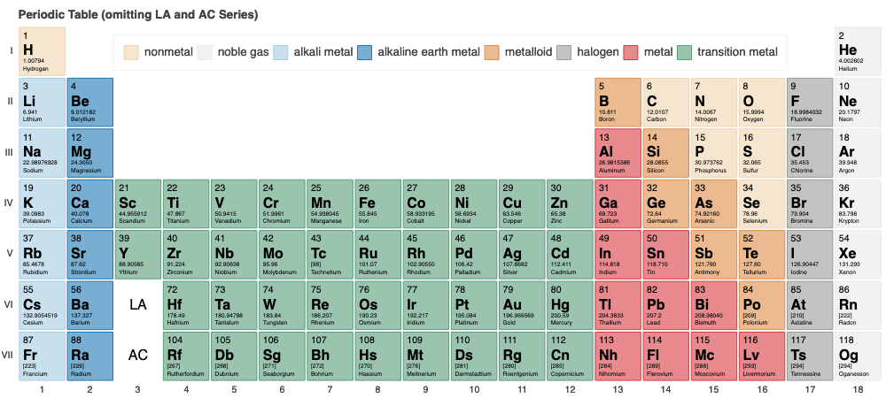

# Data visualization: approaches to creating effective figures
## Jeremy R. Manning
### PSYC 81.09: Storytelling with Data

---

## On the nature of data and data comprehension

A dataset is just a **collection of values** (numbers, text, etc.). In principle we could display those raw values to our audience, but that's usually ineffective at conveying the **specific message** we want to get across.

---

## Which is clearest to you?

---

## Why visualize data?

- Our visual systems **rapidly process massive amounts of information** and are adept at **pattern recognition**
- We can leverage the visual system to convey patterns in data
- Conveying the patterns we want people to perceive means figuring out how to **turn data into pictures**

---

## Anscombe's quartet

These four datasets have identical summary statistics, but look very different when plotted!

---

## The Datasaurus Dozen

Another striking example of why visualization matters.

---

## Grammar of graphics: intuition

A language for describing *all* possible figures. The main idea is to **separate data from how we visualize it**. This can be a useful framework for thinking about data visualization.

---

<!-- _class: scale-90 -->

## Grammar of graphics: layers

- **Data**: what information (values) we'll be plotting
- **Aesthetics**: mapping from data into a "data representation space"
- **Geometries**: what shapes can be used to represent the data
- **Facets**: define subplots (groupings) of the data
- **Statistics**: define statistical models and summaries
- **Coordinates**: maps coordinates in data space onto the figure
- **Theme**: any non-data elements of the figure

---

## Grammar of graphics: takeaways

Even if you never use GoG tools explicitly, it's useful to consider what the **separable elements** of figures are and how they affect the figure's appearance.

---

## Considerations for deciding how to display data

- Do you want to display the raw values or a summary (or both)?
- Are the observations discrete or continuous?
- What patterns in the data do you want to explore or emphasize?
- **What message do you want your audience to take away?**

---

<!-- _class: scale-90 -->

## Approaches to displaying data

- **Raw data**: show individual datapoints
- **Summaries**: highlight trends or patterns
- **Combinations**: show both raw data *and* trends
- **Polar plots**: circular data

- **Clustering**: display groupings in data
- **Timeseries**: show changes over time
- **Networks**: links between datapoints
- **Geospatial**: geographic maps
- **Animations**: movement conveys information

---

# Displaying "raw" data
### Directly map each observation onto a single point or shape

---

## Table

---

## Bar graph

---

## Bar graph (grouped)

---

## Bar graph (stacked)

---

## Scatterplot (2D)

---

## Scatterplot (3D)

---

## Heatmap

---

## Volume plot

---

# Summaries
### Characterize overarching trends or patterns without showing individual datapoints

---

## Report

---

## Histograms and density plot

---

## Two-dimensional histogram or density plot

---

## Ridge plot

---

## Regression line

---

## Vector field

---

## Streamline plot

---

# Combination plots
### Show both the individual datapoints *and* the summary in a single plot

---

## Violin plot

---

## Swarm plot

---

## Boxenplot

---

## Box (and whiskers) plot

---

## Joint plot (scatter)

---

## Joint plot (hex)

---

## Pair grid

---

## Scatterplot matrix

---

## Raincloud plot

---

# Polar plots
### Display circular (angular) data, or visualize summaries using polar coordinates

---

## Polar area chart (AKA Coxcomb chart, Rose chart)

---

## Pie chart

---

## Target (bullseye) plot

---

# Clustering
### Emphasize or display groupings in the data

---

## Dendrogram

---

## Clustermap

---

# Timeseries data
### Show changes over time

---

## Line plot

---

## Ribbon plot

---

# Networks
### Highlight physical or conceptual links between datapoints

---

## Undirected graph

---

## Directed graph

---

## Circos plots (AKA Chord diagram)

---

## Circular tree

---

## Node colormap

---

## Edge colormap

---

## Ego graph

---

# Geospatial data
### Geographic maps (locations, addresses, GPS coordinates, etc.)

---

## Map projections

Also see [Wikipedia: List of map projections](https://en.wikipedia.org/wiki/List_of_map_projections)

---

## Choropleth map

---

## Bubble map

---

## Geographical line plot

---

# Animations
### Use movement to convey additional information

---

## Uber trips in New York City

---

## Yearly life expectancy vs. GDP throughout the world

---

## Brain-decoded thoughts from different people listening to a story

---

# Classics

---

## Periodic table

---

## Minard's map of Napoleon's Russian campaign

---

## FiveThirtyEight's electoral votes depictions

---

## General tips and tricks

- Tufte's **data-to-ink ratio** principle
- Optimize for **intuition and readability**
- Use consistent color schemes to highlight connections
- Use visual weight across figure elements
- **Be willing to break all of the rules!**

