# Introduction to Git and GitHub

Jeremy R. Manning

PSYC 81.09: Storytelling with Data

---

## What is version control?

<div class="definition-box">

**Version control** is a system that tracks changes to your files over time. Think of it like Google Docs version history, but for code and entire projects. It lets you:
- See exactly what changed and when
- Collaborate with others without overwriting each other's work
- Undo mistakes by rolling back to any previous version

</div>

---

## Git vs GitHub

<div class="note-box">

**Git** is a *tool* that runs on your computer. It tracks changes to files in a folder (called a repository).

**GitHub** is a *platform* (a website) that hosts Git repositories online, making it easy to share code, collaborate, and back up your work.

Git works without GitHub, but GitHub needs Git.

</div>

---

## Creating a GitHub account

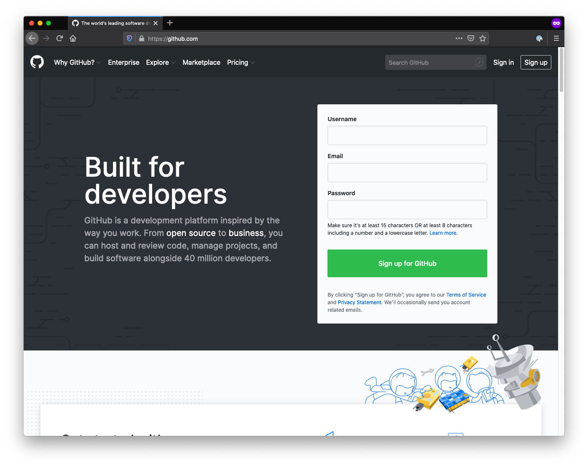

Go to [github.com](https://github.com) and sign up with your Dartmouth email. Choose a professional username — this will be part of your public coding identity.

---

## Key concept: Repositories

<div class="tip-box">

A **repository** (or "repo") is a project folder tracked by Git. It contains all your files *plus* the complete history of every change ever made.

</div>

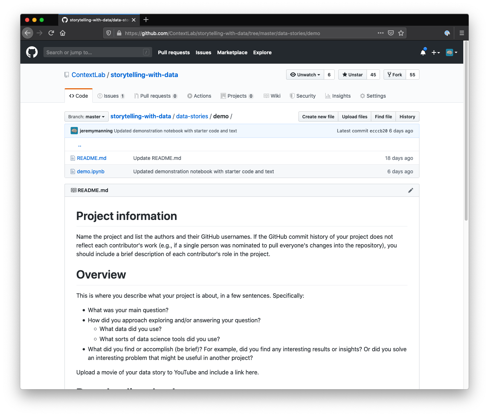

---

## Key concept: Commits

<div class="definition-box">

A **commit** is a snapshot of your project at a specific point in time. Each commit includes:
- The changes you made
- A **commit message** describing *what* changed and *why*
- A unique ID, a timestamp, and the author's name

Think of commits as "save points" in a video game.

</div>

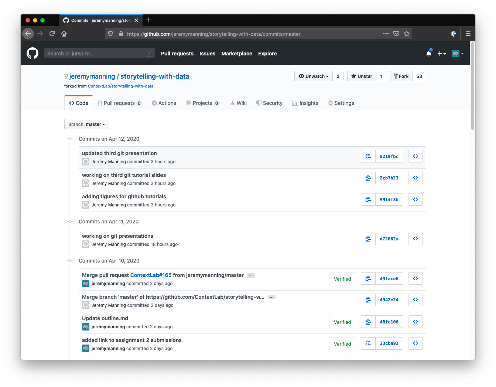

---

<!-- _class: scale-90 -->

## Key concept: Branches

<div class="note-box">

A **branch** is a parallel version of your project. The default branch is called `main` (or `master`).

Branches let you experiment with new ideas without affecting the stable version. When you're happy with your changes, you can **merge** the branch back.

</div>

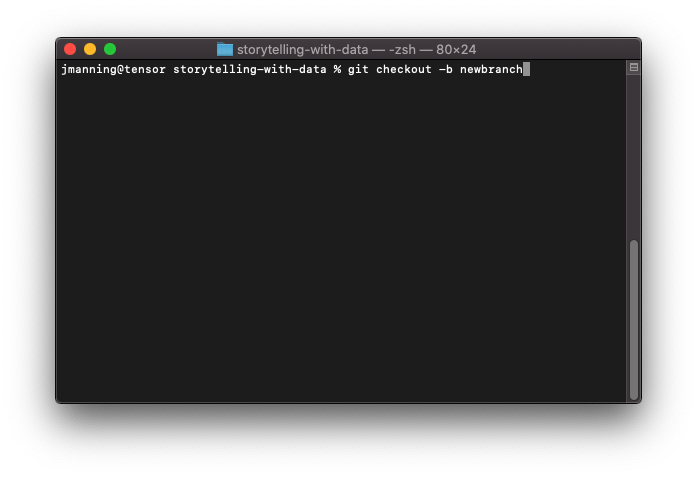

---

## Key concept: Merging and Pull Requests

<div class="definition-box">

**Merging** combines changes from one branch into another.

A **Pull Request** (PR) is a proposal to merge your changes. It lets others review your work before it becomes part of the main project.

</div>

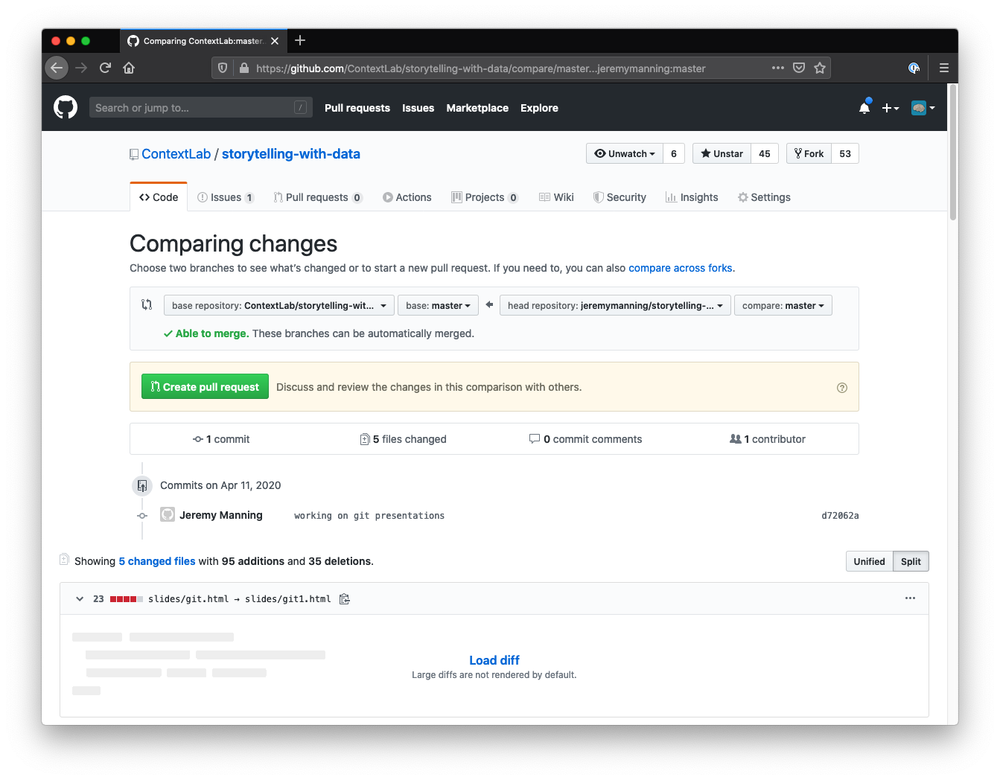

---

<!-- _class: scale-90 -->

## The collaboration workflow

<div class="example-box">

The standard open-source workflow:

1. **Fork** — copy someone's repo to your GitHub account
2. **Clone** — download your fork to your computer
3. **Branch** — create a branch for your changes
4. **Edit** — make your changes
5. **Commit** — save snapshots of your work
6. **Push** — upload your commits to GitHub
7. **Pull Request** — propose your changes to the original repo
8. **Merge** — the maintainer accepts your changes

</div>

---

## Forking and Cloning

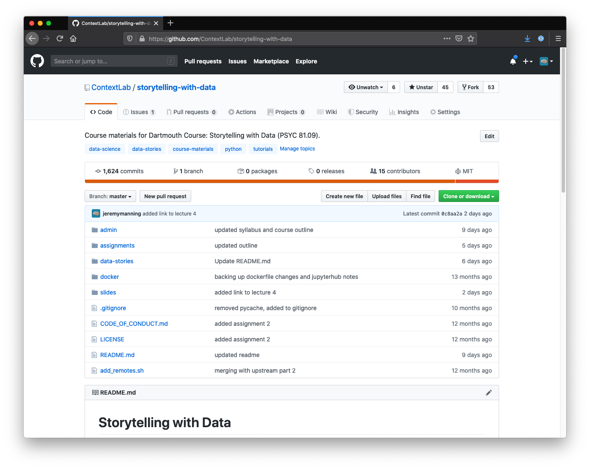

**Forking** creates your own copy of a repo on GitHub. **Cloning** downloads that copy to your computer so you can work on it locally.

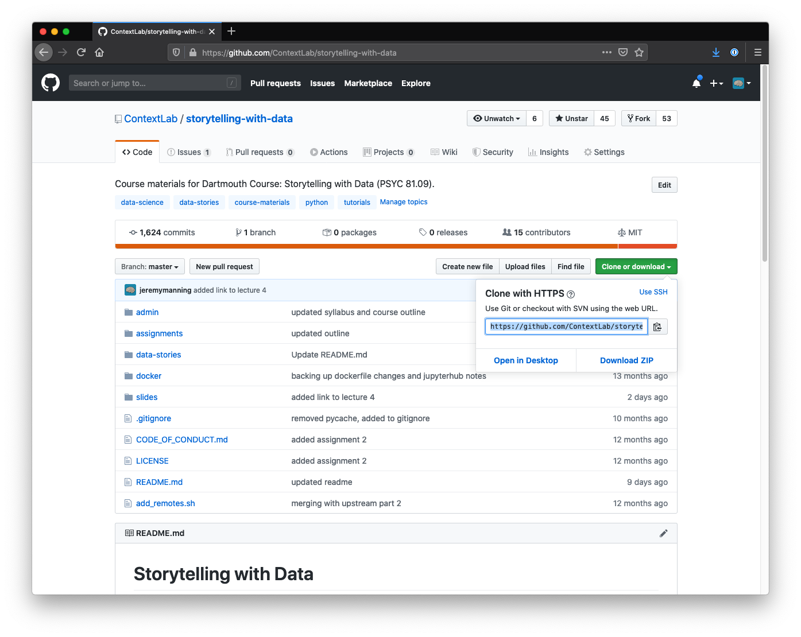

---

## .gitignore

<div class="tip-box">

A `.gitignore` file tells Git which files to **skip** — they won't be tracked or uploaded. Common things to ignore:
- **Data files** (large CSVs, datasets)
- **Secrets** (API keys, passwords)
- **Build artifacts** (compiled files, caches)
- **System files** (`.DS_Store`, `__pycache__/`)

</div>

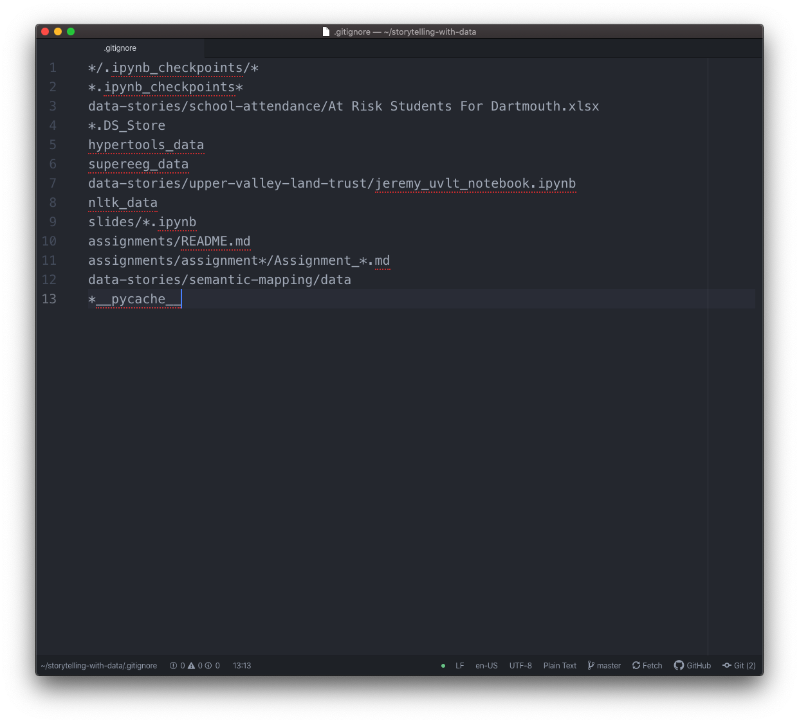

---

## Merge conflicts

<div class="warning-box">

A **merge conflict** happens when two people edit the *same lines* of the *same file*. Git can't decide which version to keep, so it asks you to choose.

Conflicts look scary but they're normal! The key steps are:
1. Read the conflicting sections carefully
2. Decide which changes to keep (or combine them)
3. Remove the conflict markers and save

</div>

---

## AI-assisted Git workflow

<div class="important-box">

**Claude Code handles most Git operations for you** — adding files, writing commit messages, committing, and pushing. Your job is to:
- **Review** what changed before approving a commit
- **Understand** the commit messages
- **Verify** the right files are being tracked

You don't need to memorize Git commands to use Git effectively!

</div>

---

## When you still need manual Git

<div class="note-box">

Even with AI assistance, it helps to understand Git when:
- **Merge conflicts** arise — you need to decide what to keep
- **Force push decisions** — overwriting remote history is dangerous
- **Reviewing diffs** — understanding what changed before you approve
- **Branch management** — choosing which branch to work on
- **Undoing mistakes** — knowing what's reversible and what isn't

</div>

---

<!-- _class: scale-90 -->

## Reading a git diff

<div class="example-box">

A **diff** shows what changed between two versions of a file:

```
- old line that was removed
+ new line that was added
  unchanged line for context
```

- Lines starting with **`-`** (red) were **removed**
- Lines starting with **`+`** (green) were **added**
- Lines with no prefix are **context** (unchanged)

When Claude Code shows you a diff before committing, read through it to make sure the changes look right!

</div>

---

## GitHub Issues

<div class="note-box">

**Issues** are how you track tasks, bugs, and feature requests on GitHub. Each issue has:
- A title and description
- Labels (e.g., `bug`, `enhancement`, `question`)
- An assignee (who's responsible)
- Comments for discussion

</div>

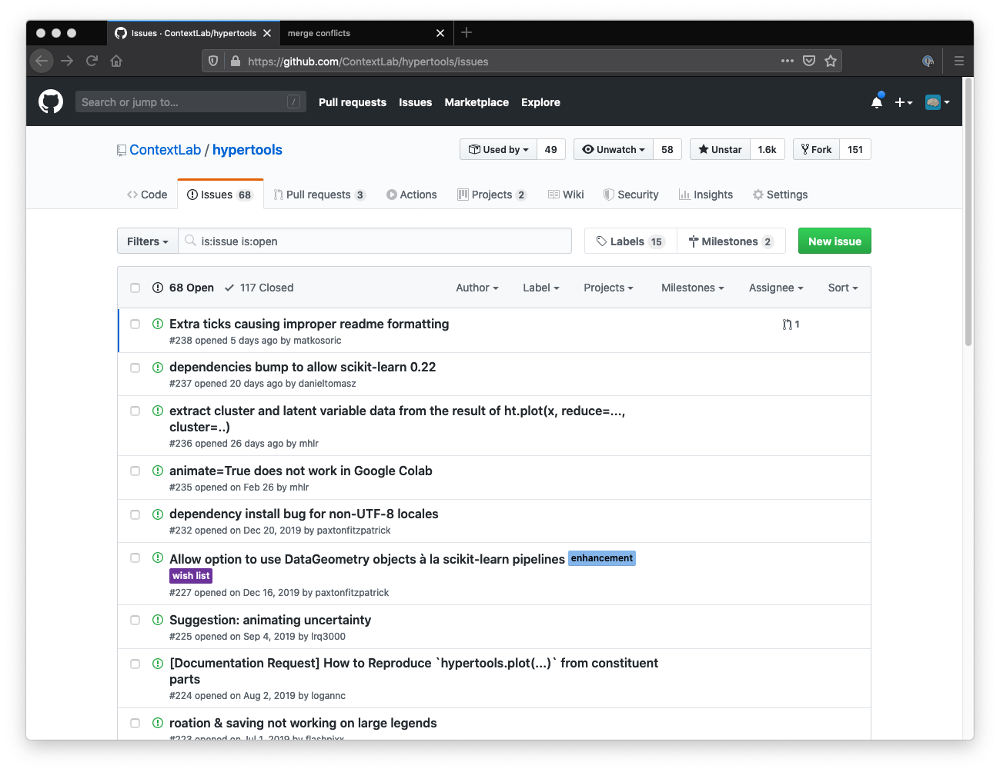

---

## GitHub Projects

GitHub **Projects** let you organize issues into boards (like a to-do list). This is useful for managing larger assignments or group work.

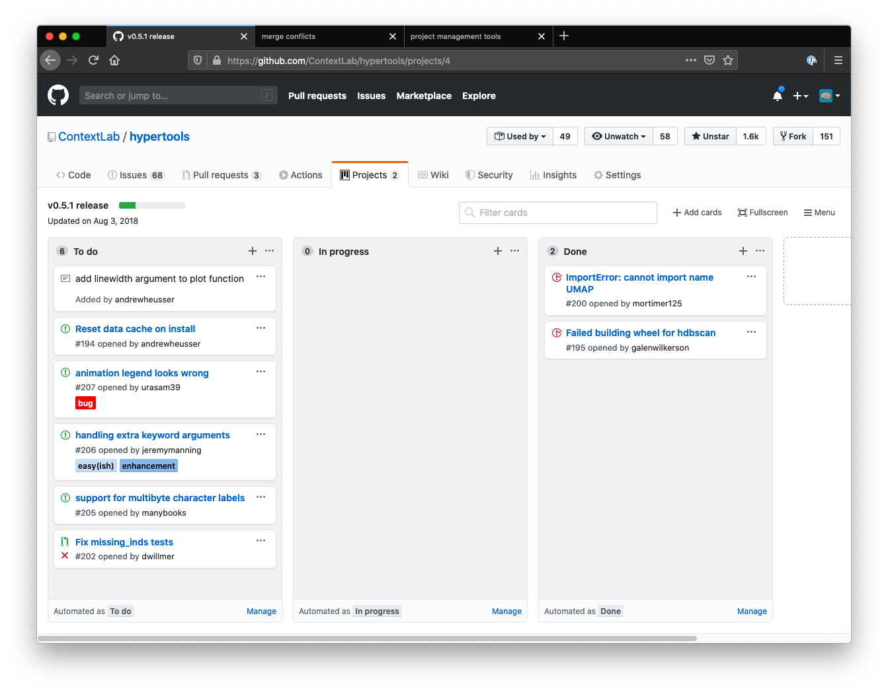

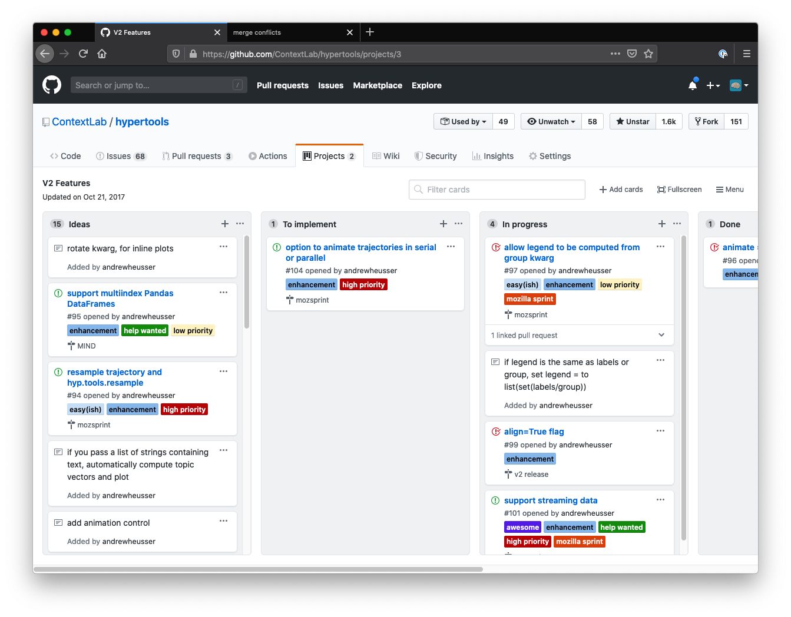

---

## Summary

<div class="tip-box">

**Key takeaways:**
- **Git** tracks changes; **GitHub** hosts your repos online
- **Commits** are snapshots; write clear commit messages
- **Branches** let you experiment safely; **PRs** let others review your changes
- The workflow: Fork → Clone → Branch → Edit → Commit → Push → PR
- **AI tools** handle most Git commands — your job is to *review and understand*
- Use `.gitignore` to keep sensitive/large files out of your repo
- **Issues** and **Projects** help you stay organized

</div>

---

# Questions? Want to chat more?

<div class="emoji-figure">
  <div class="emoji-col">
    <span class="emoji emoji-xl emoji-bg emoji-bg-navy">&#x1F4E7;</span>
    <span class="label"><a href="mailto:jeremy@dartmouth.edu">Email</a> me</span>
  </div>
  <div class="emoji-col">
    <span class="emoji emoji-xl emoji-bg emoji-bg-purple">&#x1F4AC;</span>
    <span class="label">Join our <a href="https://stories-about-data.slack.com">Slack</a></span>
  </div>
  <div class="emoji-col">
    <span class="emoji emoji-xl emoji-bg emoji-bg-green">&#x1F481;</span>
    <span class="label">Come to <a href="https://context-lab.com/scheduler">office hours</a></span>
  </div>
</div>

<div class="note-box" data-title="Up next...">

- Check the course schedule for what's coming next

</div>
