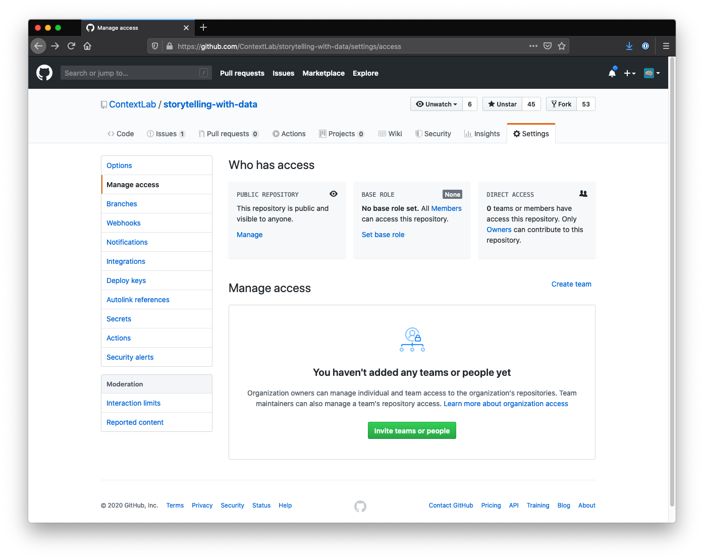

# Introduction to Git and GitHub
## Jeremy R. Manning
### PSYC 81.09: Storytelling with Data

---

## Getting started

To use Git and GitHub you need to **create a GitHub account** and **configure permissions** so your local machine can communicate with GitHub.

---

---

