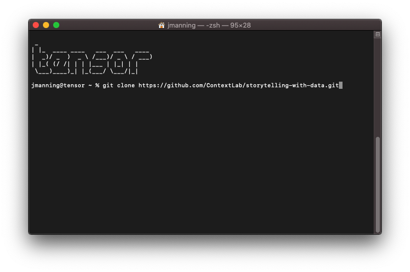
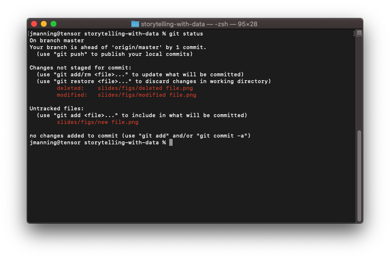

# Git and GitHub basics: `fork`, `clone`, and `status`
## Jeremy R. Manning
### PSYC 81.09: Storytelling with Data

---

## Key concepts

- **`fork`**: Copy someone else's repository to your own GitHub account
- **`clone`**: Download a repository from GitHub to your local machine
- **`status`**: Check which files have been modified, staged, or are untracked

---

---

---

---

