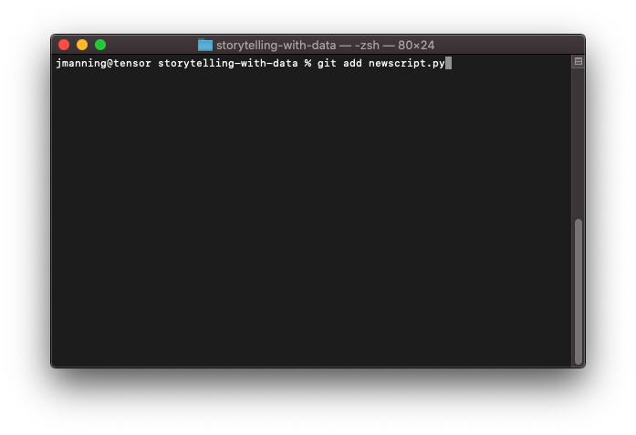
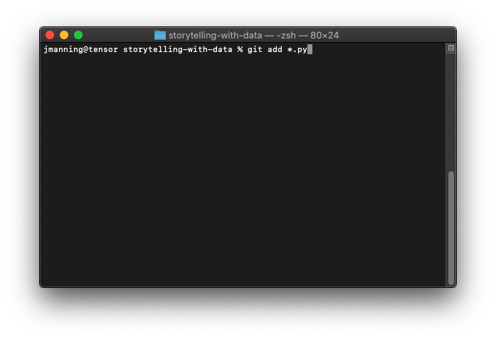
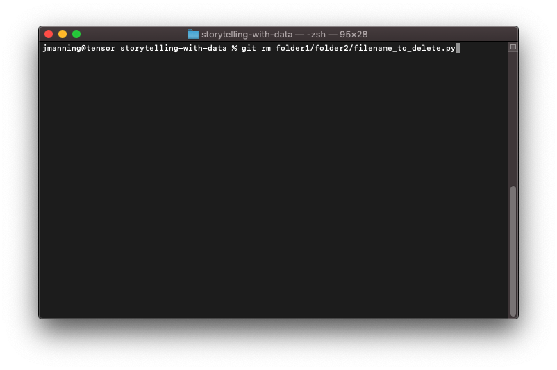
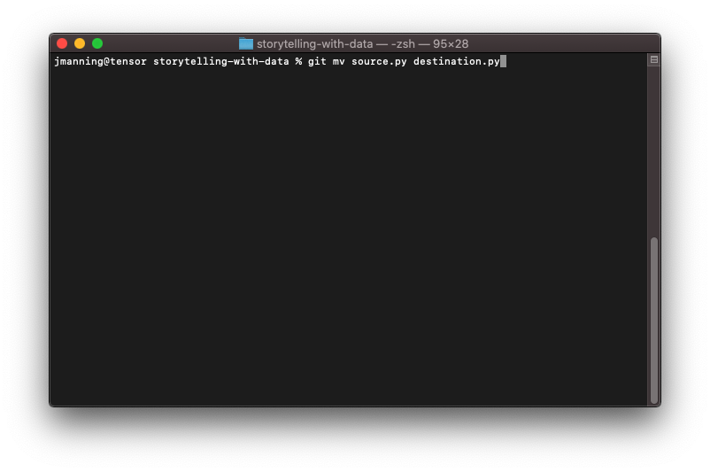
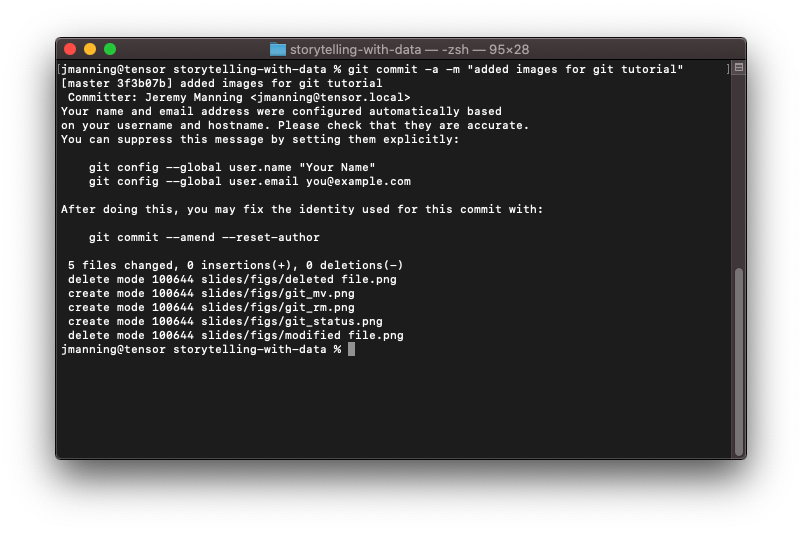
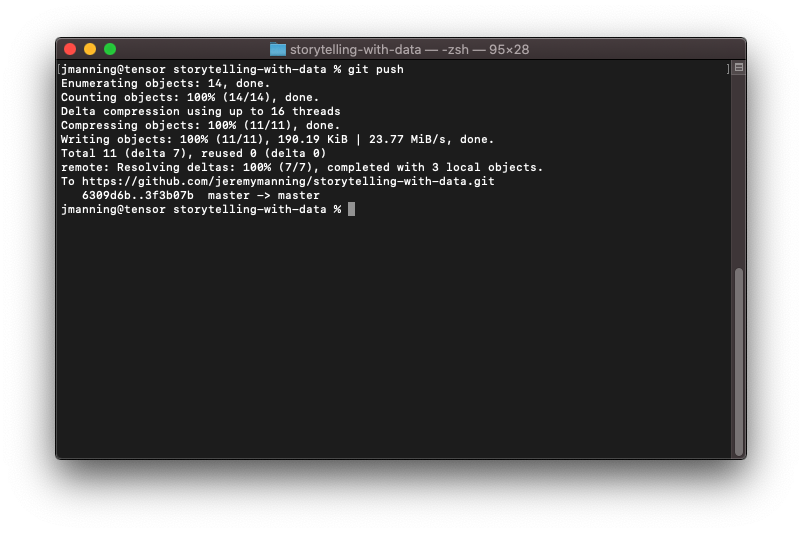
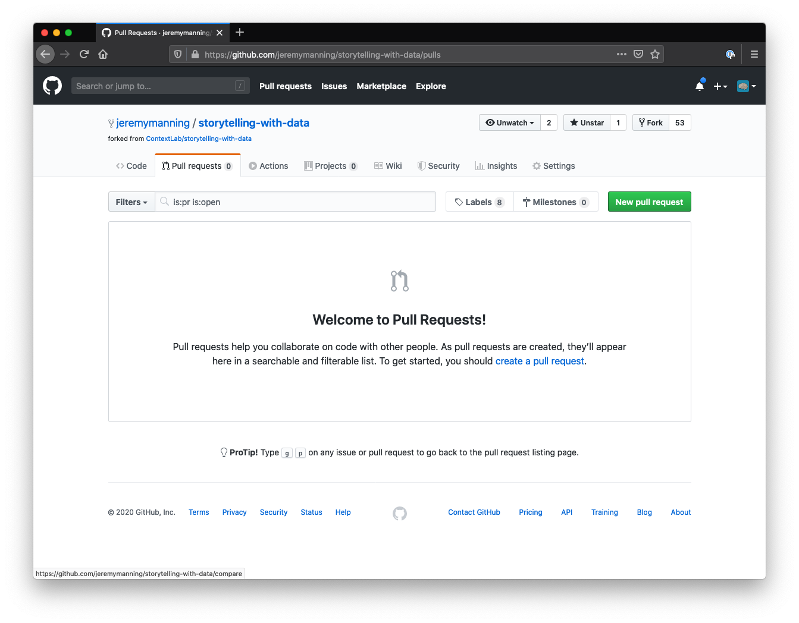

# Git and GitHub basics: `add`, `rm`, `mv`, `commit`, `push`, and `pull`
## Jeremy R. Manning
### PSYC 81.09: Storytelling with Data

---

<!-- _class: scale-90 -->

## Key concepts

- **`add`**: Stage files for the next commit
- **`rm`**: Remove files from tracking
- **`mv`**: Rename or move tracked files

- **`commit`**: Save staged changes with a message
- **`push`**: Upload commits to GitHub
- **`pull request`**: Propose merging your changes

---

---

---

---

---

---

---

---

---

