# Intermediate Git and GitHub: `ignore`, `revert`, `checkout`, `branch`, `merge`, and `remote`
## Jeremy R. Manning
### PSYC 81.09: Storytelling with Data

---

<!-- _class: scale-90 -->

## Key concepts

- **`.gitignore`**: Exclude files from tracking
- **`revert`**: Undo a previous commit
- **`checkout`**: Switch to a specific commit or branch

- **`branch`**: Create parallel lines of development
- **`merge`**: Combine branches together
- **`remote`**: Manage connections to other repositories

---

---
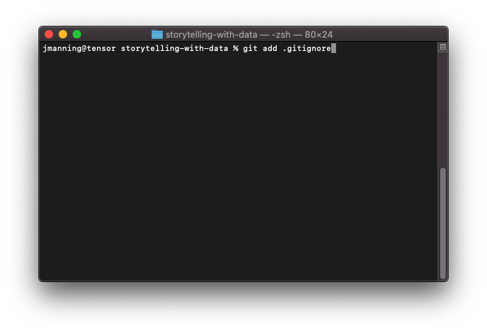

---
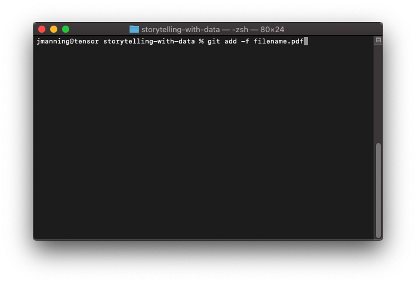

---
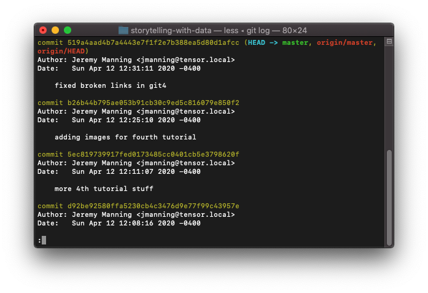

---
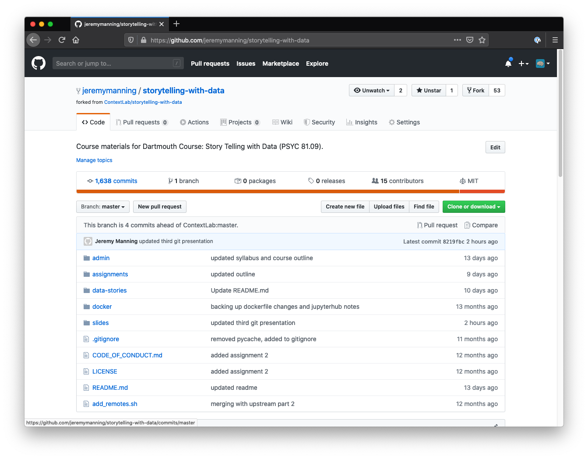

---

---
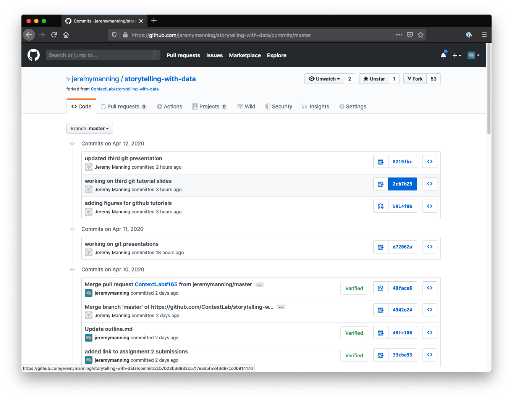

---
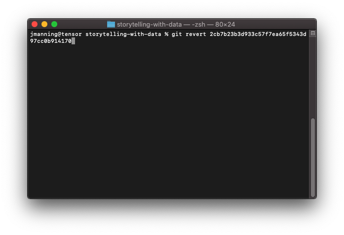

---

---

---
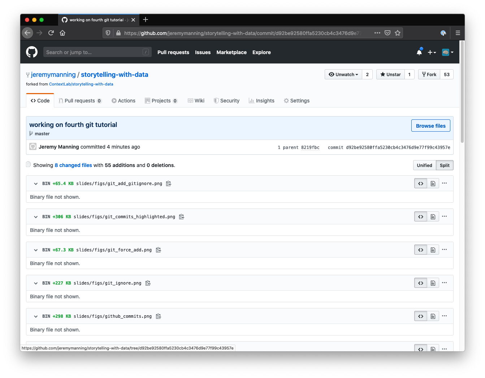

---
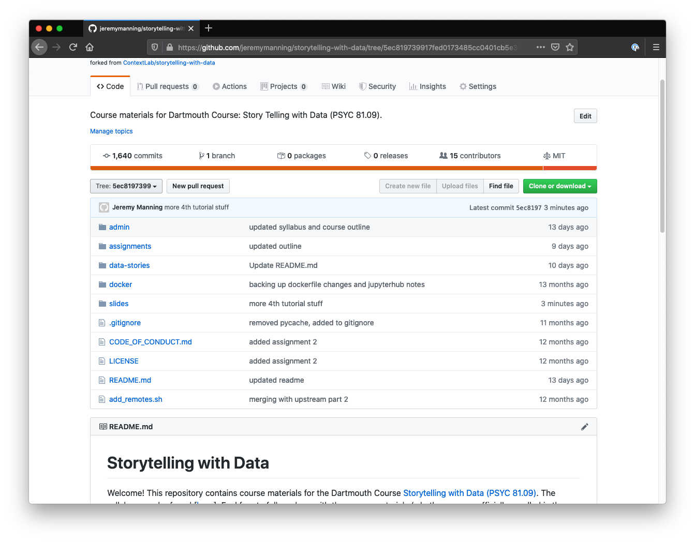

---
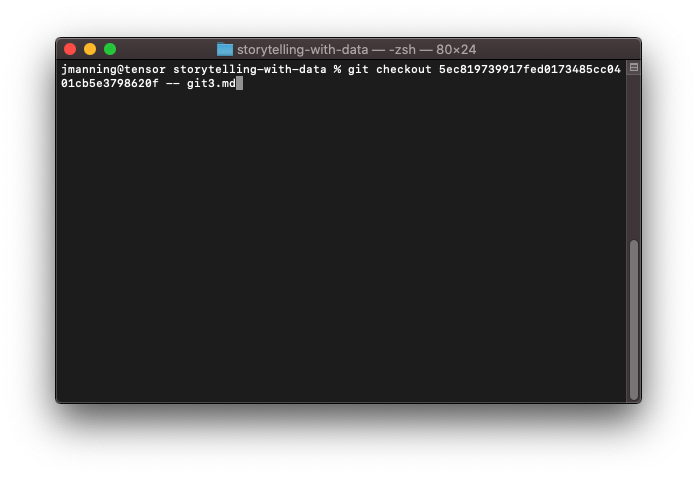

---

---
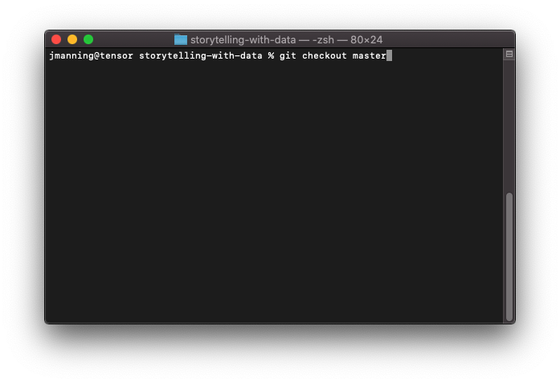

---

---
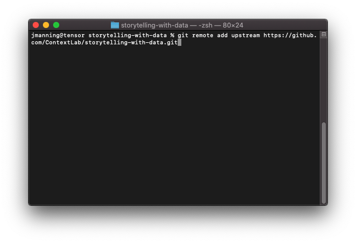

---
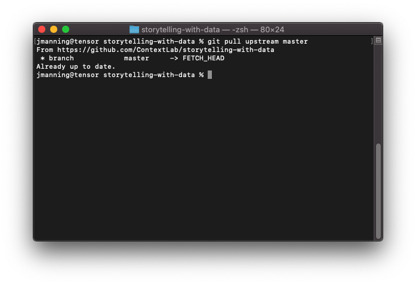
