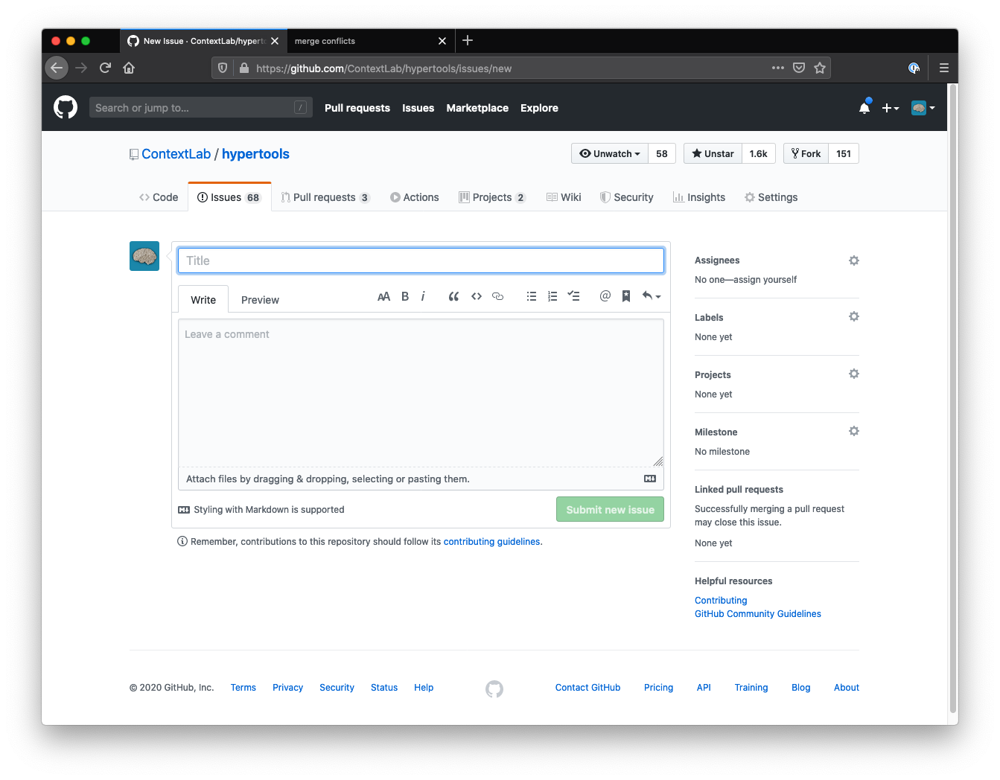
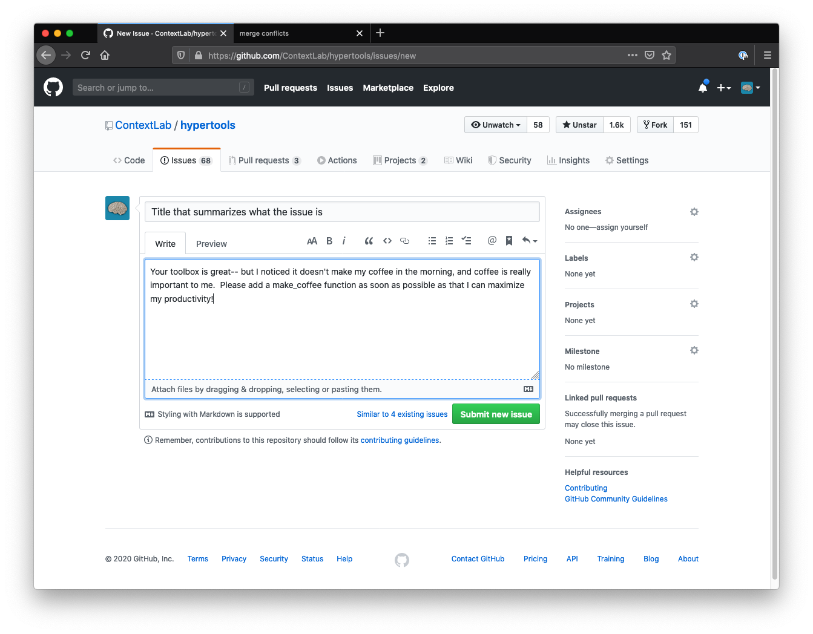
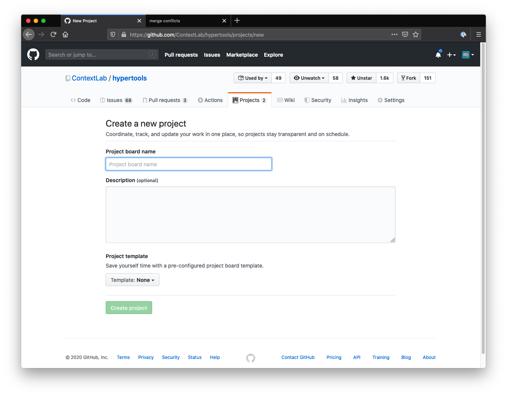

# GitHub project management tools
## Jeremy R. Manning
### PSYC 81.09: Storytelling with Data

---

## Project management features

GitHub provides built-in tools for **tracking work** and **organizing tasks**:
- **Issues**: Report bugs, request features, or track to-dos
- **Projects**: Kanban-style boards to organize and prioritize issues

---

---

---

---

---

---

