# Visualizing high-dimensional data with HyperTools
## Jeremy R. Manning
### PSYC 81.09: Storytelling with Data

---

## We live in an era of data


<div class="note-box" data-title="The data explosion">

Every day, we generate and collect **massive amounts of data** from sensors, social media, scientific instruments, and more. Making sense of all this data requires powerful tools for **exploration and visualization**.

</div>

---

## What is high-dimensional data?


<div class="definition-box" data-title="High-dimensional data">

Data where each observation is described by **many features or measurements**. For example, a brain scan might measure activity at **tens of thousands of locations** simultaneously. Each location is a "dimension."

</div>

---

## The brain generates high-dimensional data

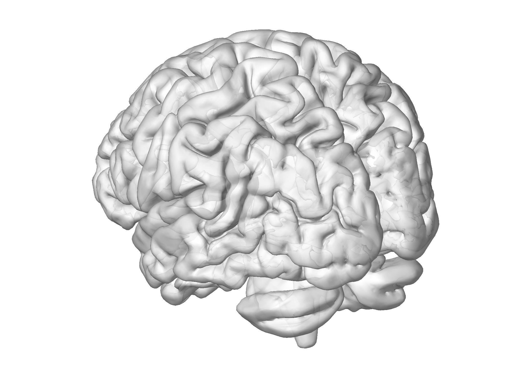

<div class="important-box" data-title="Neural activity">

- The brain contains **billions of neurons** organized into networks
- Functional MRI measures activity across **tens of thousands of voxels**
- Each timepoint is a snapshot of brain-wide activity -- a single point in a very high-dimensional space

</div>

---

## Brain activity snapshots

Each image shows a single moment of brain activity while watching a movie -- the pattern of activation changes over time:

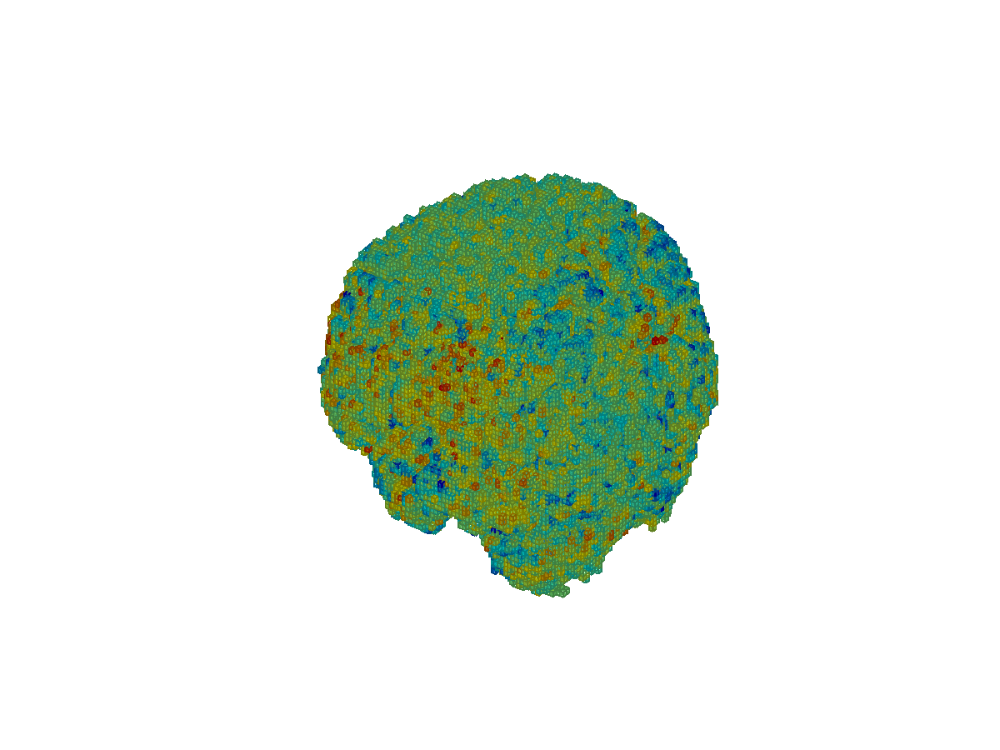 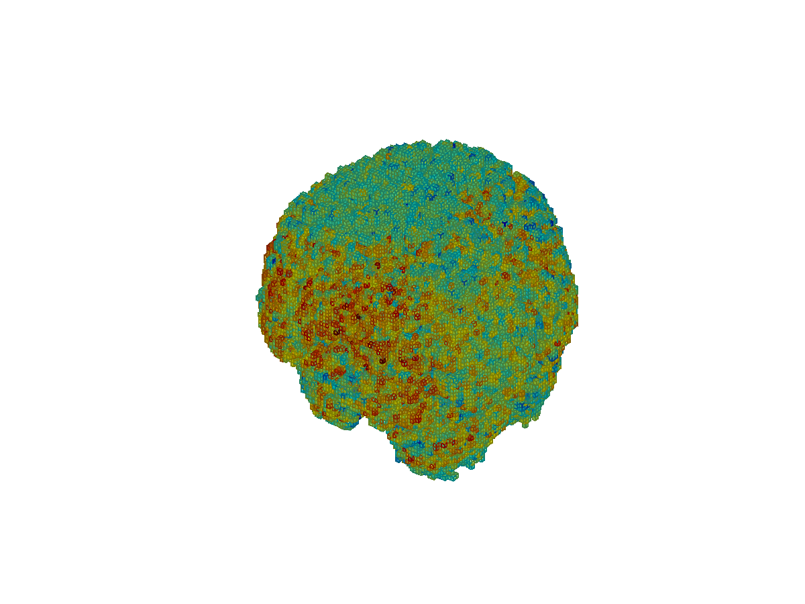 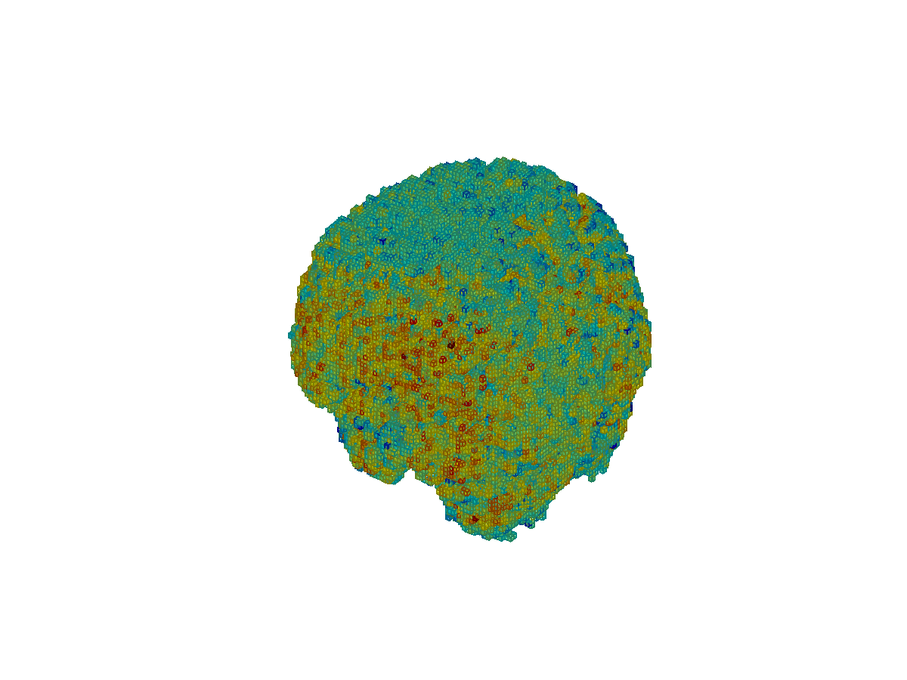 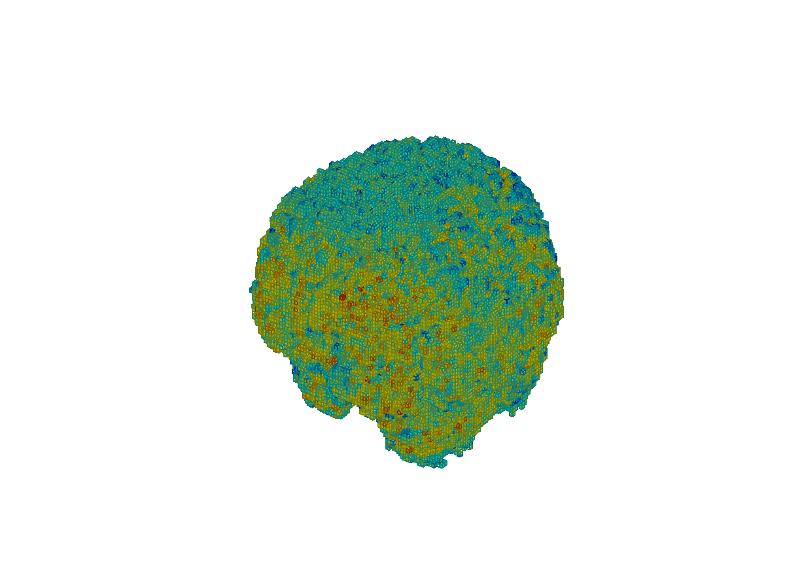 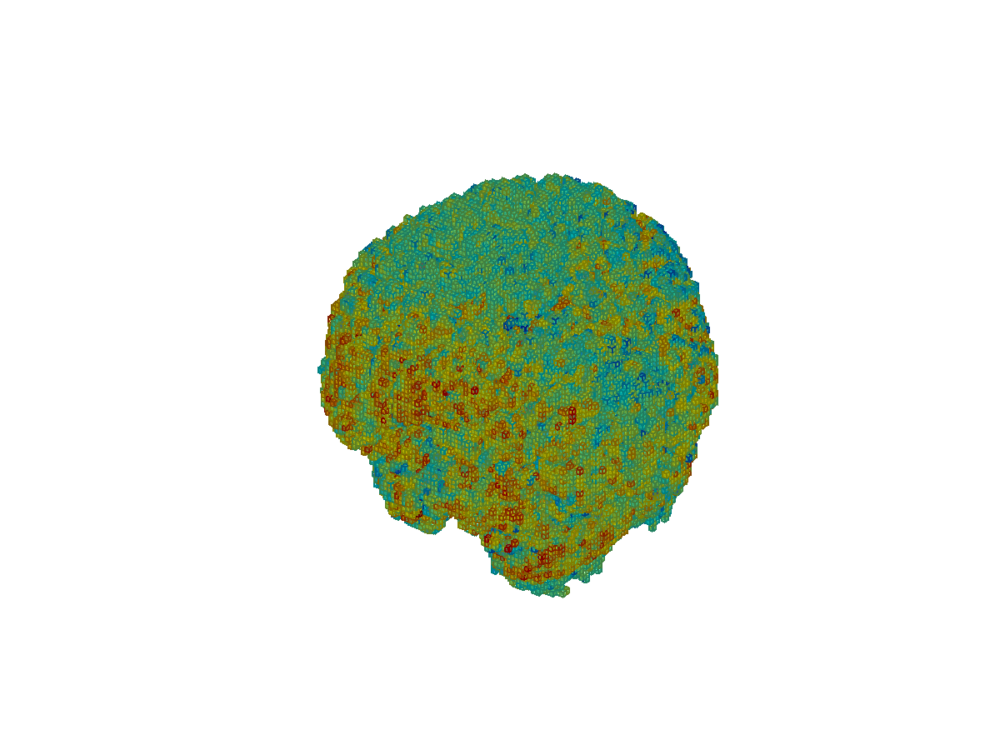

<div class="note-box" data-title="Key insight">

Each snapshot is a point in a space with thousands of dimensions. How can we visualize the **trajectory** through this space over time?

</div>

---

## Thought spaces

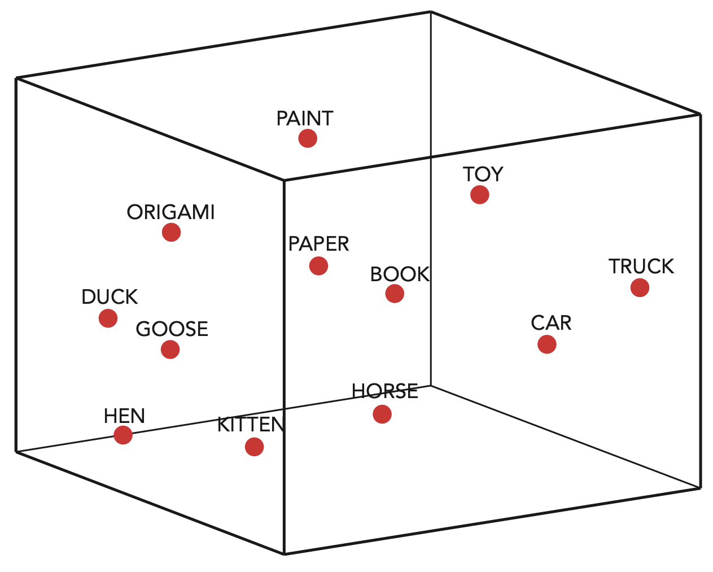

<div class="definition-box" data-title="Geometric models of thought">

We can think of concepts as **points in a high-dimensional space**, where the distance between points reflects their **semantic similarity**. Related concepts (e.g., HEN, GOOSE, DUCK) cluster together.

</div>

---

## Contextual drift through thought space

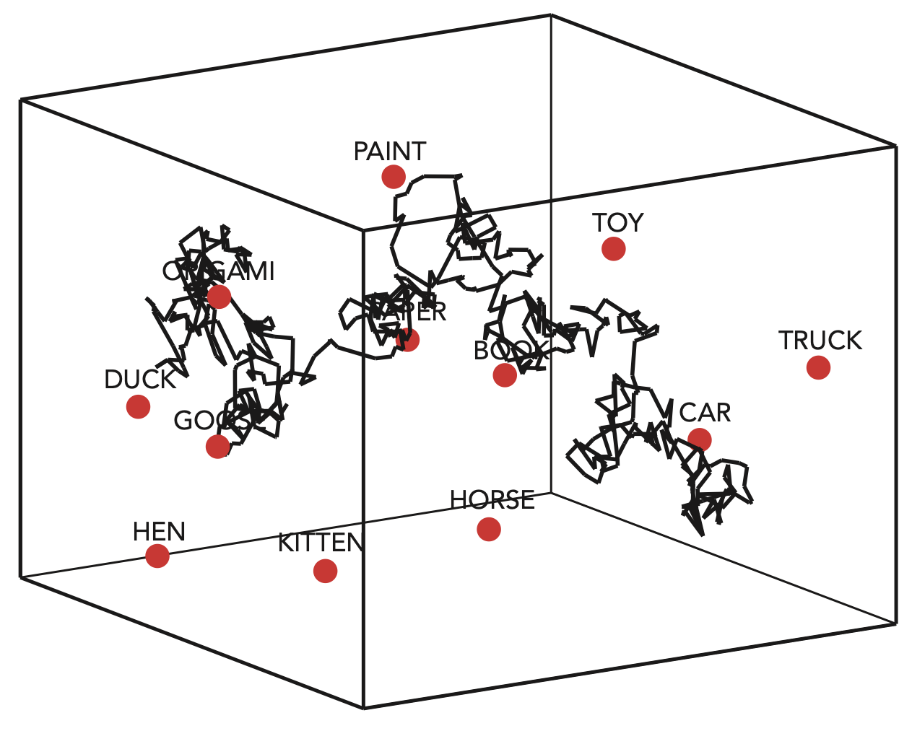

<div class="note-box" data-title="Trajectories of thought">

As we think, read, or watch a movie, our mental state **traces a trajectory** through this high-dimensional thought space -- drifting between clusters of related concepts over time.

</div>

---

## Shared experiences

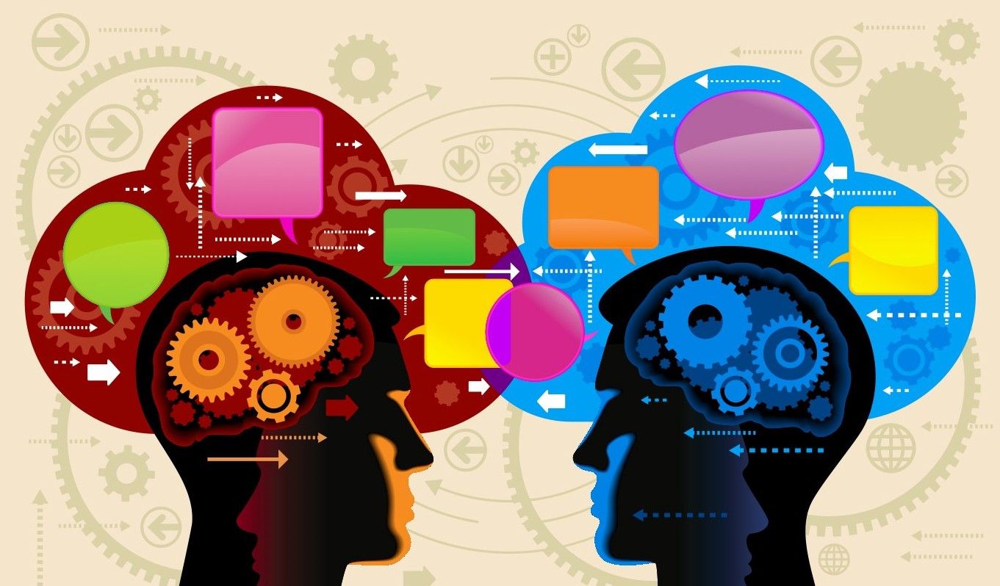

<div class="important-box" data-title="Common ground">

When people share an experience (e.g., watching the same movie), their brain activity patterns become **similar**. We can use geometric tools to **align** these patterns and compare how different people traverse thought space.

</div>

---

## We need the right tools


<div class="tip-box" data-title="Visualization challenges">

High-dimensional data is impossible to visualize directly -- we can only see in 2D or 3D. We need tools that can **reduce** the dimensionality while preserving the important structure, and then **plot** the results.

</div>

---

## Dimensionality reduction

<div class="definition-box" data-title="What is dimensionality reduction?">

A family of techniques that take high-dimensional data and produce a **low-dimensional representation** that preserves key relationships. Common methods include **PCA**, **t-SNE**, and **UMAP**.

</div>

<div class="note-box" data-title="Intuition">

Imagine shining a flashlight on a 3D sculpture and looking at its **shadow** on the wall. The shadow is a 2D projection that captures some (but not all) of the 3D structure. Dimensionality reduction finds the **best shadow**.

</div>

---

<!-- _class: scale-90 -->

## Data visualization with Python


<div class="note-box" data-title="The Python ecosystem">

Python provides a rich ecosystem for data visualization:
- **matplotlib**: low-level plotting
- **seaborn**: statistical visualization
- **scikit-learn**: machine learning and dimensionality reduction
- **HyperTools**: high-level tool that combines all of the above for high-dimensional data

</div>

---

## Introducing HyperTools

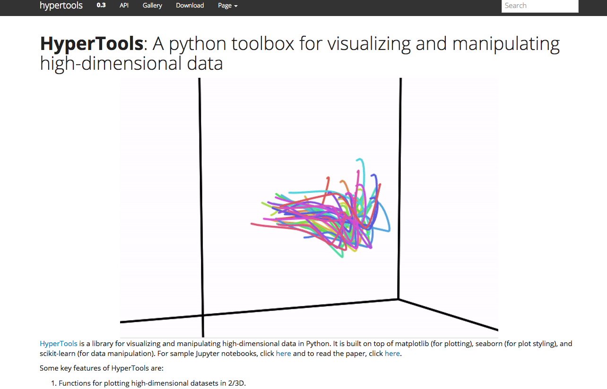

---

<!-- _class: scale-90 -->

## What is HyperTools?

<div class="definition-box" data-title="HyperTools">

A **Python toolbox** for visualizing and manipulating high-dimensional data. Built on top of matplotlib, seaborn, and scikit-learn.

</div>

<div class="tip-box" data-title="Installation">

```bash
pip install hypertools
```

</div>

<div class="note-box" data-title="Key capabilities">

- Plot high-dimensional data in **2D or 3D** (static and animated)
- **Dimensionality reduction** (PCA, t-SNE, UMAP, and more)
- **Hyperalignment** for comparing datasets across participants
- **Clustering** and **normalization** built in

</div>

---

## Basic usage

<div class="tip-box" data-title="Plotting high-dimensional data">

```python
import hypertools as hyp
import numpy as np

# Create some high-dimensional data (100 timepoints x 50 dimensions)
data = np.random.randn(100, 50)

# Visualize as a 3D trajectory (auto-reduces with PCA)
hyp.plot(data, '.')
```

</div>

<div class="note-box" data-title="What happens under the hood">

HyperTools automatically applies **PCA** to reduce your data to 3 dimensions and plots the result as a trajectory through 3D space.

</div>

---

## Visualizing brain data with HyperTools

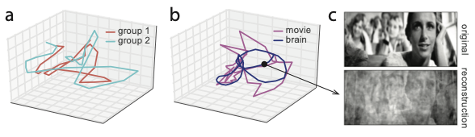

<div class="note-box" data-title="Neural trajectories">

Brain activity patterns from people watching a movie can be reduced to **3D trajectories**. Each colored line represents a different participant or group. Similar trajectories indicate **shared neural responses**.

</div>

---

<!-- _class: scale-90 -->

## Core functions

<div class="note-box" data-title="The HyperTools API">

| Function | Purpose |
|-|-|
| `hyp.plot` | Visualize high-dimensional data in 2D/3D |
| `hyp.reduce` | Apply dimensionality reduction (PCA, t-SNE, UMAP) |
| `hyp.align` | Hyperalign datasets into a common space |
| `hyp.cluster` | K-means clustering on the data |
| `hyp.normalize` | Normalize/preprocess data |
| `hyp.describe` | Get a text description of your data |

</div>

---

## Reducing dimensions

<div class="tip-box" data-title="Choosing a method">

```python
# PCA (default) -- fast, linear
reduced = hyp.reduce(data, reduce='PCA', ndims=3)

# t-SNE -- good for clusters, nonlinear
reduced = hyp.reduce(data, reduce='TSNE', ndims=2)

# UMAP -- preserves global + local structure
reduced = hyp.reduce(data, reduce='UMAP', ndims=3)
```

</div>

<div class="important-box" data-title="Trade-offs">

- **PCA**: fast, preserves global variance, but linear
- **t-SNE**: reveals clusters, but slow and non-deterministic
- **UMAP**: good balance of speed and quality

</div>

---

## Aligning across participants

<div class="definition-box" data-title="Hyperalignment">

Different people's brains are organized differently. **Hyperalignment** learns rotation matrices that map each person's neural data into a **common space**, enabling direct comparison of neural trajectories.

</div>

<div class="tip-box" data-title="Usage">

```python
# Align a list of datasets (one per participant)
aligned = hyp.align(data_list)

# Then visualize together
hyp.plot(aligned)
```

</div>

---

## Summary

<div class="important-box" data-title="Key takeaways">

- High-dimensional data is everywhere, especially in neuroscience
- **Dimensionality reduction** lets us visualize structure that would otherwise be invisible
- **HyperTools** provides a simple Python interface to plot, reduce, align, and cluster high-dimensional data
- Thinking about data **geometrically** -- as trajectories through high-dimensional spaces -- provides powerful intuitions

</div>

<div class="tip-box" data-title="Learn more">

- Documentation: [hypertools.readthedocs.io](https://hypertools.readthedocs.io)
- Install: `pip install hypertools`

</div>

---

# Questions? Want to chat more?

<div class="emoji-figure">
  <div class="emoji-col">
    <span class="emoji emoji-xl emoji-bg emoji-bg-navy">&#x1F4E7;</span>
    <span class="label"><a href="mailto:jeremy@dartmouth.edu">Email</a> me</span>
  </div>
  <div class="emoji-col">
    <span class="emoji emoji-xl emoji-bg emoji-bg-purple">&#x1F4AC;</span>
    <span class="label">Join our <a href="https://stories-about-data.slack.com">Slack</a></span>
  </div>
  <div class="emoji-col">
    <span class="emoji emoji-xl emoji-bg emoji-bg-green">&#x1F481;</span>
    <span class="label">Come to <a href="https://context-lab.com/scheduler">office hours</a></span>
  </div>
</div>

<div class="note-box" data-title="Up next...">

- Check the course schedule for what's coming next

</div>
