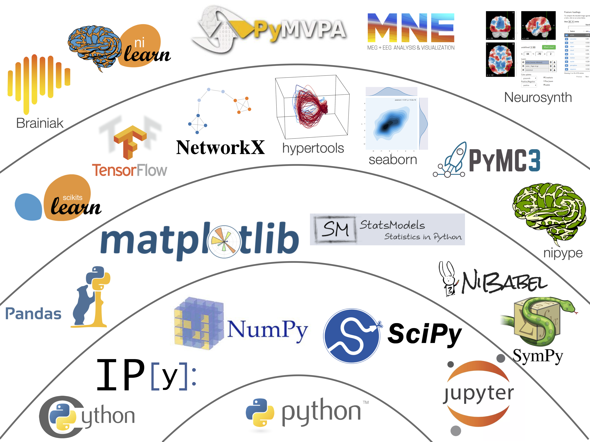

# Python Modules and the Data Science Stack
## Jeremy R. Manning
### PSYC 81.09: Storytelling with Data

---

### How we approach tools in this course

<div class="note-box" data-title="Philosophy (Donoghue §3.1)">

In this course, we focus on understanding **WHAT** these tools do and **WHEN** to use them -- not memorizing syntax. AI handles the syntax; you handle the thinking.

</div>

Your job is to:
1. **Know which tool** solves which problem
2. **Describe** what you want in plain language
3. **Verify** the generated code does what you expect

---

### What is a Python module?

<div class="definition-box" data-title="Python Modules">

- A Python *module* is a package that provides access to **functions**, **variables**, and **data** within your workspace.
- Modules extend the *Python standard library* -- they are Python's "apps."
- AKA: library, package, toolbox, toolkit

</div>

<div class="tip-box" data-title="Installing Modules">

Install with `pip install <module_name>` in Terminal, or `!pip install <module_name>` in Colab.

</div>

---

### The Python data science stack



---
<!-- _class: scale-90 -->

### Key libraries you will encounter

| Library | What it does | When to reach for it |
|-|-|-|
| **NumPy** | Fast numerical arrays and math | Crunching numbers, linear algebra |
| **Pandas** | Tabular data (spreadsheets) | Loading CSVs, filtering rows, grouping |
| **Matplotlib / Seaborn** | Plotting and visualization | Any time you make a figure |
| **Scikit-learn** | Machine learning | Classification, clustering, regression |
| **HyperTools** | High-dimensional data visualization | Exploring complex datasets |

You do not need to memorize their APIs. You need to know **which one to ask for**.

---

### What is NumPy?

<div class="definition-box" data-title="NumPy = NUMerical PYthon">

- The **foundation** of nearly every data science tool in Python.
- Introduces the `array` object: an *n*-dimensional table of numbers (vectors, matrices, tensors).
- Provides **vectorized operations** -- math applied to entire arrays at once, without writing loops.

</div>

---

### When to reach for NumPy

<div class="note-box" data-title="Use NumPy when...">

- You need **fast numerical operations** on arrays or matrices
- You are working with **large datasets** where Python lists would be too slow
- You need **linear algebra**, random number generation, or statistical summaries
- Another library (Pandas, Scikit-learn, etc.) returns or expects a NumPy array

</div>

<div class="tip-box" data-title="When NOT to use NumPy">

If your data is tabular with mixed types (strings, dates, numbers), reach for **Pandas** instead.

</div>

---

### The core idea: vectorized operations

NumPy replaces slow Python loops with fast, readable one-liners:

```python
import numpy as np

# instead of this...
result = []
for i in range(1000):
    result.append(i ** 2)

# ...write this
result = np.arange(1000) ** 2
```

The second version is **shorter**, **faster**, and **easier to read**.

---

### Vibe coding: from idea to working code

<div class="important-box" data-title="The Vibe Coding Workflow">

1. **Describe** the analysis you want in plain English
2. **Generate** code using an AI assistant (e.g., Claude Code)
3. **Run** the code and inspect the output
4. **Verify and explain** -- make sure you understand every section

</div>

This is how modern data scientists work. The skill is in knowing what to ask for and whether the result is correct.

---
<!-- _class: scale-90 -->

### Demo: describing a numerical task

Suppose you want to analyze how *correlated* different variables are in a dataset. You might prompt:

<div class="example-box" data-title="Example Prompt">

"Load the Iris dataset from scikit-learn. Compute the correlation matrix of the four numeric features using NumPy. Then plot it as a heatmap with Seaborn, labeling axes with feature names."

</div>

Notice: the prompt names **specific tools** (NumPy, Seaborn, scikit-learn) and describes the **goal**, not the syntax.

---
<!-- _class: scale-90 -->

### Demo: generated code

```python
import numpy as np
import seaborn as sns
import matplotlib.pyplot as plt
from sklearn.datasets import load_iris

iris = load_iris()
corr = np.corrcoef(iris.data, rowvar=False)

plt.figure(figsize=(6, 5))
sns.heatmap(corr, annot=True, fmt=".2f",
            xticklabels=iris.feature_names,
            yticklabels=iris.feature_names,
            cmap="coolwarm")
plt.title("Iris Feature Correlations")
plt.tight_layout()
plt.show()
```

AI generated this in seconds. Your job is to **understand what it does**.

---
<!-- _class: scale-90 -->

### Verify and explain

Walk through the generated code and answer:

1. **Where does the data come from?** (`load_iris()` -- a built-in scikit-learn dataset)
2. **What does `np.corrcoef` compute?** (Pearson correlation coefficients between columns)
3. **Why `rowvar=False`?** (Tells NumPy that columns are variables, rows are observations)
4. **What does the heatmap show?** (Which features move together vs. independently)

If you cannot answer these questions, you are not ready to move on.

---

### Try it yourself

<div class="example-box" data-title="Exercise">

Open a Colab notebook and use an AI assistant to generate code for the following task:

"Create a 1000-element array of random numbers drawn from a normal distribution. Compute the mean and standard deviation. Then plot a histogram with 30 bins and overlay a vertical line at the mean."

After the code runs, **explain each line** to a partner or in a markdown cell.

</div>

---

### Building your toolkit intuition

<div class="tip-box" data-title="How to Decide Which Tool to Use">

Ask yourself:
- **Is my data a table with column names?** --> Pandas
- **Do I need fast math on arrays of numbers?** --> NumPy
- **Am I fitting a model or classifier?** --> Scikit-learn
- **Do I need a plot?** --> Matplotlib or Seaborn
- **Am I exploring high-dimensional structure?** --> HyperTools

When in doubt, describe your goal to an AI assistant and let it pick the library.

</div>

---

### Before you move on

<div class="warning-box" data-title="Verify and Explain">

Before moving on: **read the generated code and explain in your own words what each section does and why.**

- If a line uses a function you have never seen, look up what it returns.
- If you cannot explain *why* a step is there, you do not yet understand the analysis.
- Understanding beats memorization. The AI can write the code -- only you can judge whether it answers your question.

</div>

---

# Questions? Want to chat more?

<div class="emoji-figure">
  <div class="emoji-col">
    <span class="emoji emoji-xl emoji-bg emoji-bg-navy">&#x1F4E7;</span>
    <span class="label"><a href="mailto:jeremy@dartmouth.edu">Email</a> me</span>
  </div>
  <div class="emoji-col">
    <span class="emoji emoji-xl emoji-bg emoji-bg-purple">&#x1F4AC;</span>
    <span class="label">Join our <a href="https://stories-about-data.slack.com">Slack</a></span>
  </div>
  <div class="emoji-col">
    <span class="emoji emoji-xl emoji-bg emoji-bg-green">&#x1F481;</span>
    <span class="label">Come to <a href="https://context-lab.com/scheduler">office hours</a></span>
  </div>
</div>

<div class="note-box" data-title="Up next...">

- Check the course schedule for what's coming next

</div>
