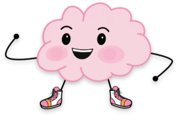
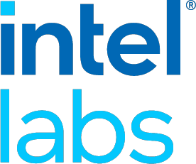
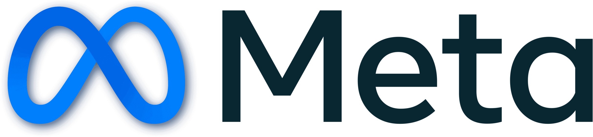

# The pursuit of truth
## PSYC 81.09: Storytelling with Data

Jeremy R. Manning
Dartmouth College
Spring 2026

---

# Who am I?
<!-- _class: manual-layout -->

<h3 style="color: #001c12 !important; margin: 0;">Jeremy R. Manning, Ph.D.</h3>

Associate Professor | Psychological &amp; Brain Sciences |  | <a href="https://context-lab.com/scheduler">Moore 349</a>

<a href="https://www.context-lab.com" class="header-link"><u>context-lab.com</u></a>

<a href="https://github.com/ContextLab" class="header-link"><u>ContextLab</u></a>

<h4>Research focus</h4>

How do our brains support our ongoing conscious thoughts, and how (and what) do we remember?

<h4>Key areas</h4>

Learning and memory, education technology, brain network dynamics, data science, NLP

<h4>Approach</h4>

Theory, models, experiments, neuroimaging

<h4>Training</h4>

B.S., Neuroscience &amp; Computer Science

Ph.D., Neuroscience

Postdoc, Computer Science &amp; Neuroscience

<h4>Funding &amp; collaborators</h4>

---
<!-- _class: scale-90 -->

## Welcome!

This course is a **data science bootcamp** wrapped in the art of storytelling. You will learn to:

- Find, analyze, interpret, and visualize data
- Craft compelling narratives grounded in evidence
- Use modern tools — Python, Jupyter, and AI-assisted coding — to tell stories that matter

*Whether you pursue data science, medicine, policy, research, business, or myriad other fields, these skills will serve you well **nearly everywhere**!*

I strongly believe in **teaching by doing**. We will learn concepts through hands-on practice. You will build a portfolio of data stories that you can share with future employers, collaborators, and friends. We'll critically evaluate each others' stories in a supportive environment, and you'll learn to give and receive feedback that helps you grow.

---

<!-- _class: scale-90 -->

## Course structure

Four modules, each with an assignment:
1. What makes a good story?
2. Data visualization
3. Python and Jupyter notebooks
4. Vibe coding and data science tools

- Pick a question and a dataset (solo or in groups)
- Analyze the data, build visualizations, and create a video telling your story
- Produce a minimum of **3 data stories** during Part 2

---
<!-- _class: scale-80 -->

## Overarching goal: the pursuit of *truth*

What does it mean to **know** something?

- How did that knowledge get into your brain?
- What evidence supports it?
- What would it take to convince you otherwise?

- In my lab, I study learning and memory. I *assume* that these functions happen in the brain, and that we can learn about them by measuring brain activity.
- At a hypothetical lab one level *lower* in the hierarchy: maybe memories are stored in RNA instead of synapses. Some memories can even be passed on to offspring! (This is actually a real hypothesis in the field of epigenetics.)
- At a hypothetical lab one level *higher* in the hierarchy: maybe learning and memory are epiphenomena of more general principles of information processing that apply to all complex systems, from brains to ecosystems to economies.

---

## How do we evaluate claims?

- **Direct observation** — you saw or measured it yourself
- **Trusted testimony** — someone credible told you
- **Logical deduction** — you reasoned your way to it
- **Data and evidence** — systematic measurement and analysis

Every source of knowledge is fallible. Our measurements are always incomplete, our reasoning can be flawed, and our trusted sources can be wrong.

---

<!-- _class: scale-90 -->

## Truth in the age of information

- **Misinformation and disinformation** — false claims spread faster than corrections
- **Confirmation bias** — we seek out evidence that supports what we already believe
- **Cherry-picking data** — selecting only the numbers that tell the story you want
- **Viral narratives** — compelling stories can drown out careful analysis

Data literacy is a superpower. *When you can evaluate evidence for yourself, you are harder to mislead.*

Consider: when you ask ChatGPT to analyze some data, how can you really **know** that it did what you asked (or meant)? You need to be able to think through the process yourself to (a) ask the right questions, and (b) evaluate the answers you get.

---

<!-- _class: scale-90 -->

## Truth in the age of AI

- **Deepfakes** — synthetic audio and video that are increasingly indistinguishable from reality
- **AI-generated text** — large language models can produce fluent, convincing, and completely fabricated content
- **Synthetic data** — AI can generate realistic-looking datasets that never came from real observations
- **Automation of persuasion** — AI tools can produce targeted misinformation at scale

The ability to critically evaluate claims — and to produce honest, evidence-based analyses — has never been more important. The ability to *communicate* your arguments clearly and compellingly is also crucial. This course will help you develop both skill sets.

---

## Data as evidence

From a data science perspective, knowledge must come from (real) **data**. Data gives us tools to move beyond opinion, intuition, and anecdote toward rigorous evaluation of claims.

- Reveal patterns invisible to casual observation
- Quantify uncertainty so we know how confident to be
- Compare competing explanations systematically
- Scale analysis far beyond any individual's capacity

---

## "All models are wrong, but some are useful"

Every model, theory, or dataset is an **approximation**. No measurement captures everything. No analysis is assumption-free.

- We never have exactly the right data, or enough of it
- There are always multiple ways to analyze and interpret the same dataset
- These are **fundamental** limitations, not problems we can simply engineer away
- The goal is not perfection — it is to be **less wrong** over time

---

<!-- _class: scale-90 -->

## Critical thinking with data

- **Correlation vs. causation** — two things moving together does not mean one causes the other
- **Sampling bias** — who is (and isn't) in your dataset changes what conclusions you can draw
- **Base rate neglect** — ignoring how common something is leads to wildly wrong probability estimates
- **Overfitting** — a model that explains everything in your data may explain nothing in new data

Always ask: *What would have to be true for this conclusion to be wrong?*

---

## Stories shape how we see truth

Stories are the most powerful communication tool humans have. They can:

- **Illuminate** — making complex data accessible, memorable, and actionable
- **Mislead** — framing evidence selectively to support a predetermined conclusion

The same dataset can tell very different stories depending on what you choose to show, emphasize, or leave out.

As data storytellers, we have an obligation to be **honest** — even when the truth is complicated or inconvenient.

---

## Your mission

Learn to tell **true stories** with data — stories that are:

- **Honest** — grounded in evidence, transparent about limitations
- **Compelling** — structured, visual, and memorable
- **Evidence-based** — reproducible analyses that others can verify

---

<!-- _class: scale-90 -->

## What we'll cover this term

- **Storytelling principles** — narrative structure, audience, framing
- **Data visualization** — turning numbers into insight
- **Programming** — Python, Jupyter notebooks, Google Colab
- **Vibe coding** — using AI assistants to accelerate your workflow
- **Data science tools** — pandas, matplotlib, seaborn, scikit-learn, and more

You do not need prior programming experience. We will build up the required skill set from scratch.

---

## Discussion

- What is a claim you have seen recently that you were not sure was true?
- How would you go about evaluating it?
- What evidence would you need to feel confident one way or the other?

As we discuss, notice the difference between *wanting* something to be true and *having evidence* that it is true.

---

# Questions? Want to chat more?

  

    &#x1F4E7;
    <a href="mailto:jeremy@dartmouth.edu">Email</a> me
  

  

    &#x1F4AC;
    Join our <a href="https://stories-about-data.slack.com">Slack</a>
  

  

    &#x1F481;
    Come to <a href="https://context-lab.com/scheduler">office hours</a>
  

- **Wednesday and Thursday (X-hour):** No class (I'll be traveling)
- **Friday:** What makes a good story? We'll workshop some ideas and I'll release Assignment 1

